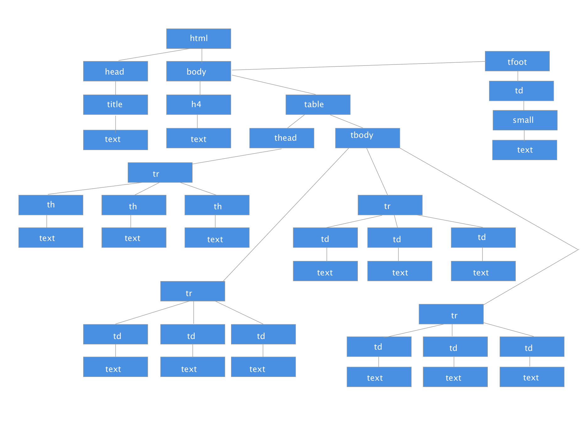

<h1 style="color:#3CCAE6">Projects</h1>

**1.** 
<p style="color:#3CCAE6">Page Rendering</p>
<p style="font-weight: bold">Analyze the HTML code given below and parse it to identify all the tokens. Create a DOM tree for the same HTML code. Is the HTML code malformed? Provide justification with proper reasoning. The HTML code to be used is given below.</p>

 <h2 style="color:#3CCAE6">Provided Code For Project:</h2>  
```html
<html>
 
 <head>
 
  <title>
 
  HTML5 Table Rendering
 
  </title>
 
 </head>
 
 <body>
 
  <h4>NFL Points Table</h4>
 
  <table id="table1">
 
   <thead>
 
    <tr>
 
    <th>NFL Franchise</th>
 
    <th>Wins</th>
 
    <th>Losses</th>
 
    </tr>
 
   </thead>
 
   <tbody>
 
    <tr>
 
    <td>Carolina Panthers</td>
 
    <td>15</td>
 
    <td>1</td>
 
    </tr>
 
    <tr>
 
    <td>Denver Broncos</td>
 
    <td>12</td>
 
    <td>4</td>
 
    </tr>
 
    <tr>
 
    <td>Dallas Cowboys</td>
 
    <td>4</td>
 
    <td>12</td>
 
    </tr>
 
   </tbody>
 
   <tfoot>
 
    <td colspan="3"><small>Official NFL League Standings 2015</small></td>
 
   </tfoot>
 
  </table>
 
 </body>
 
</html>
```

 <h2 style="color:#3CCAE6">Code Rendered on Page: </h2>  

<html>
 
 <head>
 
  <title>
 
  HTML5 Table Rendering
 
  </title>
 
 </head>
 
 <body>
 
  <h4>NFL Points Table</h4>
 
  <table id="table1">
 
   <thead>
 
    <tr>
 
    <th>NFL Franchise</th>
 
    <th>Wins</th>
 
    <th>Losses</th>
 
    </tr>
 
   </thead>
 
   <tbody>
 
    <tr>
 
    <td>Carolina Panthers</td>
 
    <td>15</td>
 
    <td>1</td>
 
    </tr>
 
    <tr>
 
    <td>Denver Broncos</td>
 
    <td>12</td>
 
    <td>4</td>
 
    </tr>
 
    <tr>
 
    <td>Dallas Cowboys</td>
 
    <td>4</td>
 
    <td>12</td>
 
    </tr>
 
   </tbody>
 
   <tfoot>
 
    <td colspan="3"><small>Official NFL League Standings 2015</small></td>
 
   </tfoot>
 
  </table>
 
 </body>
 
</html> <br>

<span class="label label-warning">Answer:</span><br>

The question first ask us to take all html tags and form a list of all the tokens.

 <p style="color:#3CCAE6">Tokens:</p>

 `<html>`,`<head>`,`<title>`,`HTML5 Table Rendering`,`</title>`,`</head>`,
 `<body>`,`<h4>`,`NFL Points Table`,`</h4>`,`<table id="table1">`,`<thead>`,`<tr>`,`<th>`,`NFL Franchise`,`</th>`,`<th>`,`Wins`,`</th>`,`<th>`,`Losses`,`</th>`,`</tr>`,`</thead>`,`</tbody>`,`<tr>`,`</thead>`,`<tbody>`,`<tr>`,`<td>`,`Carolina Panthers`,`</td>`,`<td>`,`15`,`</td>`,`<td>`,`1`,`</td>`,`</tr>`,`<tr>`,`<td>`,`Denver Broncos`,`</td>`,`<td>`,`12`,`</td>`,`<td>`,`4`,`</td>`,`</tr>`,`<tr>`, `<td>`,`Dallas Cowboys`,`</td>`,`<td>`,`4`,`</td>`,`<td>`,`12`,`</td>`,`</tr>`,`</tbody>`,`<tfoot>`,`<td colspan="3">`,`<small>`,`Official NFL League Standings 2015`,`</small>`,`</td>`,`</tfoot>`,`</table>`,`</body>`,`</html>`

 Whoa that was a lot now let's draw an image of this mapped similar to how it would appear in a DOM tree.


  

To finish up this project let's answer the final question as to whether this code is malformed. I would say that yes this code is malformed but in a small way in that on line 69 the td element is not surrounded by a tr element so :

```html 
<td colspan="3"><small>Official NFL League Standings 2015</small></td>
```

Should look like this :

```html 
<tr>
    <td colspan="3"><small>Official NFL League Standings 2015</small></td>
</tr>    
```

The way I found this out is using DevTools and seeing if there was any difference in the original code. It is a small error that for the chrome browser does not appear to affect the table in any noticeable way. 


**2.**
<p style="color:#3CCAE6">HTTP Status Codes Project:</p>
<p style="font-weight: bold">HTTP Status Codes are grouped into five specific classes with each class’ first digit specifying the response type. All the HTTP Status/Response codes are listed on the following W3C resource: HTTP Status Codes.</p>

Using this information, list three status codes from each class, starting from 1XX to 5XX, along with a brief description and the situation in which it will be returned.

The second task is to explore unofficial codes which are not a part of the W3C recommendation. Some third-party services expand the 4XX error space. List any five such response codes and their significance.


<span class="label label-warning">Answer:</span><br>

To answer this project let's break down each class of error codes for 1XX to 5XX and list three for each section with a brief description and situation it will be returned in.


 <h2 style="color:#3CCAE6">Error Codes:</h2>

<p style="color:#3CCAE6"> Informational 1XX</p>

* **100 Continue** 
   * to inform client that initial request has been received and has not been rejected by server. You want to check that the server is going to accept your request as it may be in your favor to do so to save from errors and time 
* **101 Switching Protocols**
   * sent in response to Upgrade: request by the client, indicates the protocol the sever is switching too. You want to allow move from an incompatiable protocol version - not in common use.
<p style="color:#3CCAE6"> Successful 2XX</p>
* **200 OK** 
   * is sent back if request has succeded. Any time you request information from a server and it is found and sent back
* **201 Created**
   *  when a request is made that ruesults in a new resource being created. You give a server your email and name the sever creates an object of you in its database
* **202 Accepted**
   *  request has been accepted but processing is not complete. You are submitting your payment at a website you have to wait for a couple of seconds you see prompts that say your payment has been received but you must wait a couple of seconds for it to finalize this would send a 202 first then it would send 201 thne a 200

<p style="color:#3CCAE6"> Redirection 3XX</p>
* **301 Move Permanently** 
   * requested resource has moved to a new URI and should use one of the returned URI. Visit a link that redirects you to another site
* **302 Found**
   * requested resource is under a new URI tempory URI is returned and Should be given by the location field as a response
* **303 See Other**
   * uses the GET method to retrieve a source under a new URI
<p style="color:#3CCAE6"> Client Error 4XX</p>
* **400 Bad Request** 
   * error returned by server bad sytax causes an error request must be fixed
* **401 Unauthorized**
   * requires user authentication
* **403 Forbidden**
   * sever understands request but is refusing to grant it will be returned if permissions are not allowed also 404 code can be returned instead
<p style="color:#3CCAE6"> Server Error 5XX</p>
* **500 Internal server Error** 
   *  error returned when sever encountered an unexpected condition
* **502 Bad Gateway**
   * error that is sent when the sever sends a invalid response 
* **501 Not Implemented**
   * error that is returned when the server does not support the required tools to carry out request 
<p style="color:#3CCAE6">Unofficial Error Codes</p>
* **495 SSL Certificate Required** 
   * expansion of 400 code used when client does not provide certificate this could help in pinpoint why request is not working vs. getting a plain error code
* **444 No Response**
   * error returned when server does not return any information then connection is closed
* **440 Login Time-out**
   * error returned when the client has been on too long and must login again useful for sensitive data 
* **509 Bandnwitdth Limit exceeded**
   * error returned when bandwidth is exceeded might be useful if you run a site where data usage is payed for subscriptionally 
* **450 Blocked by Window Parental Controls**
   * Used by microsoft to let client know that Parental controls is blocking access to site. 


   